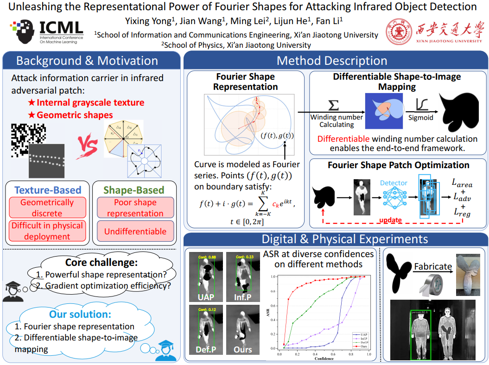

# Unleashing the Representational Power of Fourier Shapes for Attacking Infrared Object Detection

This repository contains the official implementation of **Unleashing the Representational Power of Fourier Shapes for Attacking Infrared Object Detection**. We study **physical adversarial attacks against infrared pedestrian detection** by parameterizing patch boundaries with learnable Fourier coefficients and mapping them to pixel-space masks through a differentiable winding-number formulation.

Our central claim is that Fourier shapes resolve the trade-off between **shape expressiveness** and **optimization efficiency** in prior infrared attacks. The resulting patches are compact, closed, physically manufacturable, and highly effective in both digital and physical evaluations. In the physical setting, the paper reports an attack success rate above **88%** at distances greater than 25m under conf.=0.5.

## Visual Overview

For a concise visual summary of the method, pipeline, and physical deployment, see the project poster:

<p align="center">
  
</p>

Additional figures are available in `assets/figs/`.

## Key Ideas

- **Infrared-specific adversarial mechanism**: in thermal imagery, attack effectiveness is governed primarily by geometry rather than color or texture.
- **Fourier shape parameterization**: a compact set of Fourier coefficients defines a closed contour with substantially higher representational power than discrete grid-based formulations.
- **End-to-end differentiable optimization**: the winding-number mapping provides an analytic bridge from boundary parameters to pixel masks, enabling gradient-based optimization.
- **Physical realizability**: the optimized output is a single coherent contour, which is better aligned with physical fabrication and deployment.
- **Rigorous evaluation**: the work emphasizes attack performance across confidence thresholds rather than relying on a single criterion.

## Method

The attack pipeline is:

1. Parameterize the patch boundary with Fourier series.
2. Convert the boundary into a differentiable binary-like mask via the winding number theorem.
3. Place the patch on the pedestrian region.
4. Minimize detector confidence with regularization on shape plausibility.
5. Save the optimized coefficients, rendered shapes, and adversarial examples for evaluation and fabrication.

This repository currently focuses on the **YOLOv3-based infrared attack and evaluation pipeline**.

## Repository Structure

```text
.
├── attack_fouriershape_yolov3.py   # Main optimization script
├── test_fouriershape_yolov3.py     # Evaluation script
├── base.py                         # Core Fourier attack/test implementation
├── attack_utils/                   # Data loading, patch transform, visualization, metrics
├── yolov3/                         # YOLOv3 codebase and pretrained weights
├── LLVIP_person/
│   ├── instances_imgs/             # Cropped pedestrian instances
│   └── instances_labels/           # Corresponding labels
└── assets/                  # Poster and figure assets
```

## Environment

We recommend Python 3.8+ with CUDA support.

```bash
pip install -r yolov3/requirements.txt
pip install ipdb
```

## Data

The current code expects instance-level LLVIP pedestrian data organized as:

```text
LLVIP_person/
├── instances_imgs/
└── instances_labels/
```

The training data are provided via Baidu Netdisk:

- Baidu Netdisk link: `https://pan.baidu.com/s/1CXSr89QwL23Os4iQTrYamg?pwd=utrp`

After downloading, please place the `LLVIP_person` folder in the project root directory.

Image files and label files must share the same basename. The repository currently uses the normalized naming pattern:

Labels are stored as:

```text
class_id center_x center_y width height
```

`LLVIPDataloader` directly matches each image with a same-name `.txt` label file, so custom datasets can be used as long as the same directory layout and naming convention are preserved.

## Weights

The pretrained YOLOv3 weights are provided via Baidu Netdisk:

- Baidu Netdisk link: `https://pan.baidu.com/s/1nlRC5JC88WP4_N-iv08oQQ?pwd=utrp`

After downloading, please place the `weights` folder at the same directory level as `yolov3`.

The released weights include:

- `weights/infrared.pt`
- `weights/visible.pt`

The default attack pipeline uses `infrared.pt`.

## Quick Start

### 1. Optimize Fourier-shaped adversarial patches

```bash
python attack_fouriershape_yolov3.py
```

This script:

- loads images from `LLVIP_person/instances_imgs`;
- loads labels from `LLVIP_person/instances_labels`;
- optimizes an input-specific Fourier shape for each instance;
- saves Fourier coefficients, rendered contours, and adversarial visualizations.

The default output directory is:

```text
./FourierAttack_train/exp0/
```

Typical outputs include:

- `learnable_c/`: optimized Fourier coefficients in `.json`
- `c_curve/`: rendered Fourier contours
- `advexamples_nodetect/`: adversarial examples without detected targets
- `advexamples_detect/`: adversarial examples with detector visualization
- `logs/`: per-instance optimization logs

### 2. Evaluate attack performance

```bash
python test_fouriershape_yolov3.py
```

By default, the evaluation script reads coefficients from:

```text
./FourierAttack_train/exp0/learnable_c
```

and writes results to:

```text
./FourierAttack_test/exp0
```

The current implementation supports evaluation over a range of confidence thresholds and includes AP-drop related logic.

## Default Hyperparameters

The main defaults in `base.py` are:

- highest harmonic order `N = 6`
- patch scale ratio `patch_scale = 0.6`
- optimization epochs `num_epochs = 500`
- initial learning rate `lr_init = 0.002`
- confidence loss weight `conf_weight = 3.0`
- regularization weight `reg_weight = 1.0`

These settings define the default optimization regime used by the released scripts.

## Practical Notes

- The current release is script-oriented rather than CLI-oriented.
- Several experiment settings are hard-coded in `__main__`, particularly in:
  - `attack_fouriershape_yolov3.py`
  - `test_fouriershape_yolov3.py`
- The detector code assumes CUDA availability by default.
- The repository is best suited for understanding the method, reproducing the core pipeline, and inspecting generated attack results.
- For new datasets, detectors, or experiment layouts, please first adjust the hard-coded paths, weight locations, and output directories.

## Citation

If this repository is useful for your research, please cite:

```bibtex
@inproceedings{yong2026fouriershape,
  title={Unleashing the Representational Power of Fourier Shapes for Attacking Infrared Object Detection},
  author={Yong, Yixing and Wang, Jian and Lei, Ming and He, Lijun and Li, Fan},
  booktitle={Proceedings of the 43rd International Conference on Machine Learning},
  year={2026}
}
```

## Acknowledgment

The detection component is built upon the YOLOv3 codebase and adapted for infrared object detection and attack evaluation.
